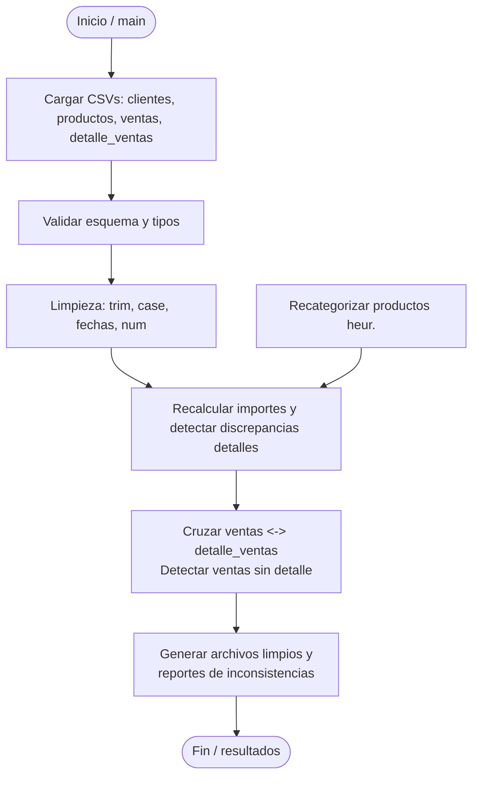

## Diagrama de flujo (Mermaid)

> [!WARNING] 
> Para visualizar el diagrama, usar Mermaid Live Editor o un editor que soporte Mermaid.

```mermaid
flowchart TB
    Start([Inicio / main])
    Load[Cargar CSVs: clientes, productos, ventas, detalle_ventas]
    Validate[Validar esquema y tipos]
    Clean[Limpieza: trim, case, fechas, num]
    Recalc[Recalcular importes y detectar discrepancias detalles]
    Recat[Recategorizar productos heur.]
    Cross[Cruzar ventas <-> detalle_ventas\nDetectar ventas sin detalle]
    Save[Generar archivos limpios y\nreportes de inconsistencias]
    End([Fin / resultados])

    Start --> Load --> Validate --> Clean
    Clean --> Recalc
    Recat --> Recalc
    Recalc --> Cross --> Save --> End
```

#